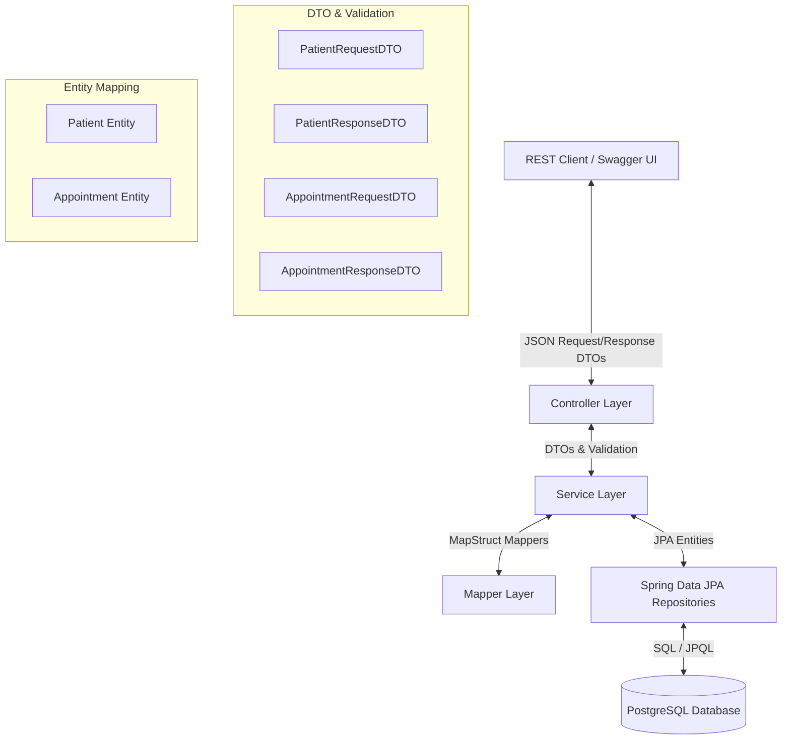

# MediCore Hospital Management System (HMS)

Built to practice designing secure, scalable REST APIs with proper separation of concerns for a real-world domain — healthcare records management.

MediCore HMS is a robust, production-ready Spring Boot 3 web application built with Java 17/21, Spring Data JPA, Spring Security, and PostgreSQL. It has been fully refactored to enforce the **Data Transfer Object (DTO)** pattern, separating the database entity layer from the REST API endpoints to ensure security, validation, and zero recursion.

---

## 🏗️ Architecture & Data Flow

Below is the high-level architecture diagram showing how requests are processed through the layered architecture:



---

## 🛠️ Technology Stack


*   **Backend Framework:** Spring Boot 3.4.x (Java 17/21)
*   **Security:** Spring Security (Role-based Basic Authentication)
*   **Database Access:** Spring Data JPA / Hibernate (ORM)
*   **Database Engine:** PostgreSQL
*   **API Specification:** Springdoc OpenAPI / Swagger UI
*   **Object Mapping:** MapStruct (Compile-time code generation)
*   **Data Validation:** Jakarta Bean Validation (Hibernate Validator)
*   **Utility & Boilerplate:** Project Lombok

---

## 📂 Project Structure

```text
src/main/java/com/tarun/HospitalManagement/
│
├── config/                 # Security, CORS, and OpenAPI/Swagger Config
├── controller/             # REST Controllers (exposing only DTOs)
├── dto/                    # Data Transfer Objects
│   ├── request/            # Request payloads with Jakarta Validation
│   └── response/           # Response payloads and lightweight summaries
├── entity/                 # Database JPA Entities
├── exception/              # Global Exception Handler and custom exception mapping
├── mapper/                 # MapStruct Interfaces (Object-to-Object mappers)
├── repository/             # Spring Data JPA repositories
└── service/                # Business logic and Transaction boundaries
```

---

## 🚀 Key Features

*   **DTO Enforced API:** Controllers accept `@Valid` DTOs and return Response DTOs. Database entities (`Patient`, `Doctor`, etc.) never escape the Service Layer.
*   **Role-Based Security:** All endpoints secured via Spring Security using Basic Authentication across 2 access roles (`ADMIN` / `USER`). Write operations (`POST` / `PUT` / `PATCH` / `DELETE`) are restricted to `ADMIN` access only; read operations are available to both roles.
*   **Decoupled Relations:** Lightweight summaries (like `AppointmentSummaryDTO` and `InsuranceSummaryDTO`) are used in response objects to break cyclic JPA graphs and prevent `Infinite Recursion` / StackOverflow errors during JSON serialization.
*   **Global Exception Handling:** Centralized handling of validation errors (`400 Bad Request` with structured field errors) and resource lookups (`404 Not Found`).
*   **Auto-generated Mapping:** Stateless, compile-time safe object mappers using MapStruct.

---

## 📋 API Overview

40+ endpoints across 5 resource domains, each with full CRUD and domain-specific queries.

| Resource         | Endpoints | Access                        | Description                                    |
|------------------|-----------|--------------------------------|------------------------------------------------|
| Patients         | 8+        | Read: All · Write: Admin       | CRUD + search/filter queries                    |
| Doctors          | 8+        | Read: All · Write: Admin       | CRUD + filter by specialty                      |
| Appointments     | 10+       | Read: All · Write: Admin       | CRUD + status/date-based queries                |
| Departments      | 6+        | Read: All · Write: Admin       | CRUD                                            |
| Insurance        | 8+        | Read: All · Write: Admin       | CRUD + coverage lookup                          |

> Update the exact counts above to match your current implementation before publishing.

---

## ⚙️ Project Setup & Installation

### Prerequisites
*   Java 17 or higher
*   Maven 3.8+
*   PostgreSQL running instance

### 1. Database Configuration
Update the `src/main/resources/application.properties` with your PostgreSQL database credentials:
```properties
spring.datasource.url=jdbc:postgresql://localhost:5432/medicore_hms
spring.datasource.username=your_username
spring.datasource.password=your_password
spring.jpa.hibernate.ddl-auto=update
```

### 2. Build the Project
Compile the project and trigger MapStruct code generation using the Maven Wrapper:
```bash
./mvnw clean compile
```

### 3. Run Unit Tests
Execute the test suites to ensure everything builds and mapping/security configurations function properly:
```bash
./mvnw test
```

### 4. Start the Application
Run the boot application:
```bash
./mvnw spring-boot:run
```

---

## 📖 API Documentation

Once the application is running, you can explore, test, and view schemas of all endpoints via Swagger UI:

*   **Swagger UI URL:** [http://localhost:8080/swagger-ui/index.html](http://localhost:8080/swagger-ui/index.html)
*   **API Docs JSON:** [http://localhost:8080/v3/api-docs](http://localhost:8080/v3/api-docs)

<!--
  Add a screenshot of the Swagger UI here once available, e.g.:
  
-->

---

## 📄 License

This project is licensed under the MIT License.
